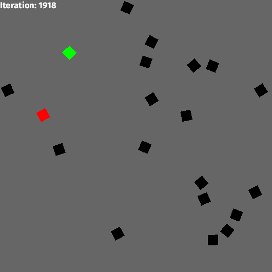

# Agent based simulation of a game of tag



* The red one is "it" and needs to come near other agents to tag them to become the new "it"
* The green one was "it" previously and cannot be tagged until there is a new "it"

Every Agent has a viewing Angle, everything outside this angle can not be seen by it.

## Setup

This project is written in rust, see [how to install rust](https://www.rust-lang.org/tools/install).

To build, run `cargo build --release`. To run the simulation run `cargo run --release`.

The simulation is quite configurable. See `cargo run --release -- --help`:
(Note that by default the simulation is slowed down a lot in order to make the visualization more interesting)
```
tag simulation 0.1.0
Simulating a game of tag.

USAGE:
    tag [FLAGS] [OPTIONS] [iterations]

FLAGS:
    -h, --help        Prints help information
        --parallel    Run the simulation in parallel using rayon
    -V, --version     Prints version information

OPTIONS:
        --agent-count <agent-count>                  Number of players [default: 10]
        --behavior <behavior>
            Behavior to use for the agents (default or chasing) [default: default]

        --delay-milliseconds <delay-milliseconds>    Milliseconds to wait between every iteration [default: 50]
        --height <height>                            Height of the playing field [default: 500]
        --viewer <viewer>
            How should the simulation be displayed (visual or command-line) [default: visual]

        --width <width>                              Width of the playing field [default: 500]

ARGS:
    <iterations>    How many iterations to simulate [default: 10000]
```

## Documentation

To get an overview over the code base, you can also generate the rustdoc documentation using `cargo doc --open`.

## Benchmarks
Performance benchmarks can be run using `cargo bench`

For future reference on my machine:
```
test chasing_behavior_100_000_agents            ... bench:  11,086,311 ns/iter (+/- 4,424,251)
test chasing_behavior_10_000_agents             ... bench:   1,055,114 ns/iter (+/- 175,626)
test chasing_behavior_10_agents                 ... bench:         819 ns/iter (+/- 11)
test chasing_behavior_1_000_000_agents          ... bench: 122,941,743 ns/iter (+/- 53,927,547)
test chasing_behavior_1_000_agents              ... bench:     103,062 ns/iter (+/- 9,961)
test default_behavior_100_000_agents            ... bench:  10,958,782 ns/iter (+/- 3,565,693)
test default_behavior_10_000_agents             ... bench:   1,037,441 ns/iter (+/- 183,496)
test default_behavior_10_agents                 ... bench:         826 ns/iter (+/- 11)
test default_behavior_1_000_000_agents          ... bench: 117,350,968 ns/iter (+/- 35,447,479)
test default_behavior_1_000_agents              ... bench:     102,035 ns/iter (+/- 7,115)
test parallel_chasing_behavior_100_000_agents   ... bench:  15,784,883 ns/iter (+/- 8,089,635)
test parallel_chasing_behavior_10_000_agents    ... bench:   1,771,039 ns/iter (+/- 499,017)
test parallel_chasing_behavior_10_agents        ... bench:      79,849 ns/iter (+/- 7,485)
test parallel_chasing_behavior_1_000_000_agents ... bench: 109,513,167 ns/iter (+/- 45,005,000)
test parallel_chasing_behavior_1_000_agents     ... bench:     140,933 ns/iter (+/- 29,010)
test parallel_default_behavior_100_000_agents   ... bench:  14,902,149 ns/iter (+/- 6,505,214)
test parallel_default_behavior_10_000_agents    ... bench:   1,793,828 ns/iter (+/- 438,943)
test parallel_default_behavior_10_agents        ... bench:      81,028 ns/iter (+/- 8,452)
test parallel_default_behavior_1_000_000_agents ... bench: 105,265,331 ns/iter (+/- 52,325,250)
test parallel_default_behavior_1_000_agents     ... bench:     144,124 ns/iter (+/- 44,567)
```
